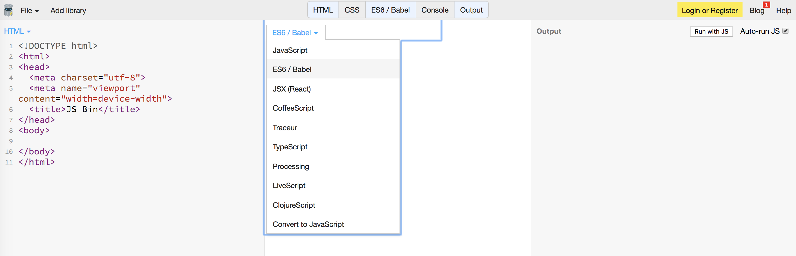
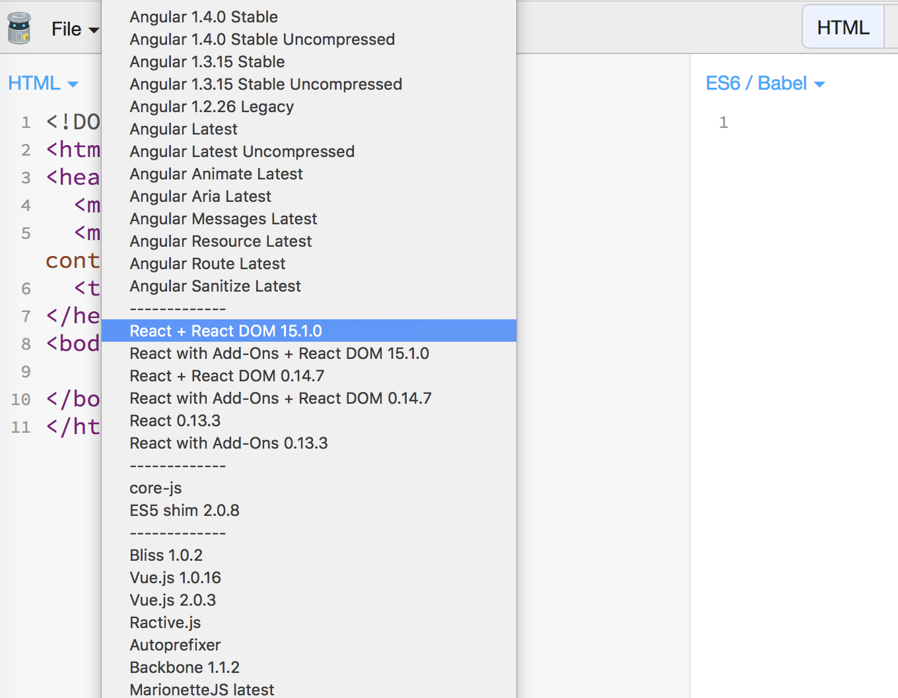

## Introduction to ReactJs

#### What are you going to learn?

- What is ReactJs and who created it
- Why we do not know it as a framework
- What is a web component
- Write your first ReactJs component

## ReactJs; a JavaScript library only

React makes it painless to create interactive UIs. Design simple views for each state in your application, and React will efficiently update and render just the right components when your data changes.

React components implement a render() method that takes input data and returns what to display. This example uses an XML-like syntax called JSX. Input data that is passed into the component can be accessed by render() via this.props.

JSX is optional and not required to use React. Try the Babel REPL to see the raw JavaScript code produced by the JSX compilation step.

It is maintained by Facebook and a community of individual developers and companies.

### Web components

As developers, we all know that reusing code as much as possible is a good idea. This has traditionally not been so easy for custom markup structures — think of the complex HTML (and associated style and script) you've sometimes had to write to render custom UI controls, and how using them multiple times can turn your page into a mess if you are not careful.

Web Components aims to solve such problems — it consists of three main technologies, which can be used together to create versatile custom elements with encapsulated functionality that can be reused wherever you like without fear of code collisions.

ReactJS is built on top of this tools and the main way to work with ReactJS is the concept of "Component"

### Getting ready to write our code

We are about to write some ReactJS styled JavaScript, in order to enter directly to the code we are going to use a web platform that will allow us to see in realtime the result of our code, this platform calls jsbin.com.
We are going to open a new doc, activate the javascript tab and change the main languaje for ES6/Babel



Now we are going to install ReactJS in this new jsbin doc, in the left up side of the website we are going to click the "Add library" button, and look for "React + React DOM 15.1.0"
React hooks is packed in ReactJs 16.8.1 but in order to learn how ReactJS works the version 15.1.0 is ok, we will get to React 16.8.1 in a while.



That's it we are ready to write a new component and use it white ReactDOM.

### Write your first component

No more wait, it's time to write our first component and use JSX. JSX is a javascript way to write HTML, it is not HTML but kind of, it is JavaScript. Yes it is weird but genius at the same tiime, because we do not have to work separetly with the temaplates and the JavaScript logic, we can work in just one document.
So we are going to create a JavaScript variable that containes a function, and this function will return some jsx, and this is going to be our first component.

```javascript
let App = function() {
  return (
    <div>
      <h1>BlisS</h1>
    </div>
  );
};

ReactDOM.render(<App />, root);
```

We are using ReactDOM library to set our first component in the html document, and the id "root" to tell where we want to put it, it is important to create a div inside the HTML tab, in order for this to work.


And "bualá" we have written our first component and set it into our website! so easly right? 😁

### Props

Before we go deeply into the kind of components and why is better to use hooks, we are going to meet the props.
The props in ReactJS we already know them but with a different name, "attributes" in HTML the "attributes" have been always been here, just like we set the src in a `` tag, but this time we are cappable to configure it as we wish, for example, we are about to create a second component, and we are going to use it inside the first one.

```javascript
let DisplayName = function() {
  return (
    <div>
      <h1>BlisS</h1>
    </div>
  );
};

let App = function() {
  return (
    <div>
      <DisplayName />
    </div>
  );
};

ReactDOM.render(<App />, root);
```

It is very important to notice some things, we can use the variable name of any component inside other component just as a tag with `<VariableName/>`. The name of the components is always with uppercase, adn finally we use the `()`in order to write the `JSX` with out problems.

Now we have our brand new component, we are going to use props inside `DisplayName`, instead of "hardcoding" the name BlisS, we are going to pass a variable for the name, as a parameter in the function.

```javascript
let DisplayName = function(props) {
  return (
    <div>
      <h1>{props.name}</h1>
    </div>
  );
};

let App = function() {
  return (
    <div>
      <DisplayName name="Héctor" />
    </div>
  );
};

ReactDOM.render(<App />, root);
```

Look how we pass a variable called "props" into the function component, and this is an object by default, we also use it inside the `<h1>` tag with these `{}` curley brackets because inside the JSX we can access variables this way, and finally look how we send this prop to the `DisplayName` component when we use it inside the `<App/>` component jus like any other html "attribute".

## Recap:

We have cover a very rapid summary of the JavaScript languaje, just in order to start working with the JavaScript tools we will cover in this course in a more confident way. You are ready to give the next step, congratulations!.

## Resources:

- [More about JavaScript](https://www.javascript.com/)
- [The most modern and stable JavaScript](http://es6-features.org/#Constants)
- [JavaScript excercises - 10 days of JavaScript](https://www.hackerrank.com/domains/tutorials/10-days-of-javascript)

> Author: @hectorbliss
